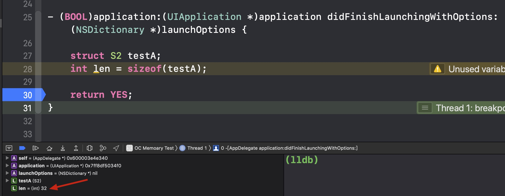
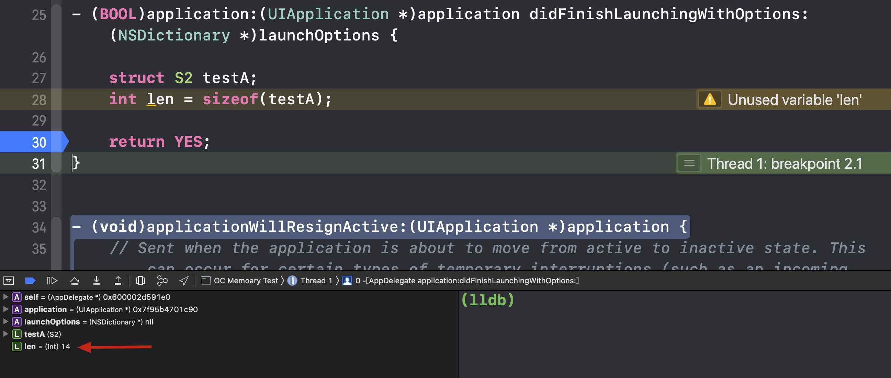
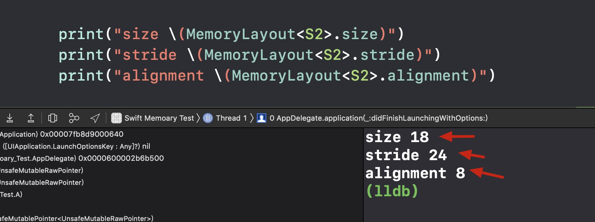
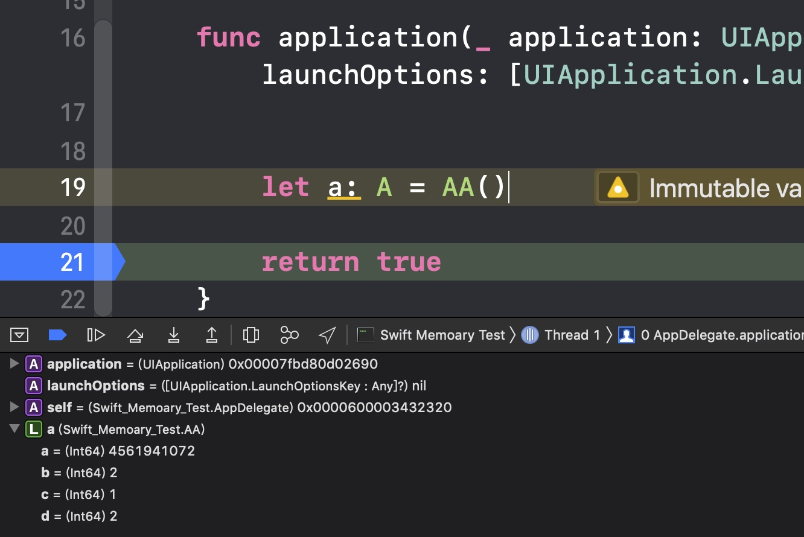
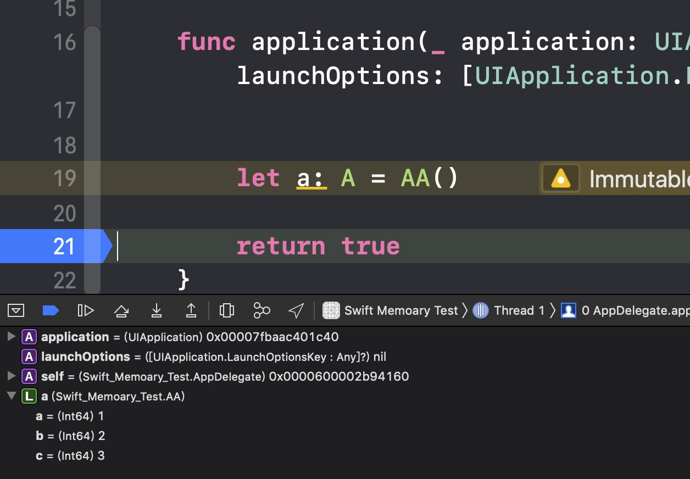

title: Swift 4.2 Struct Enum Protocol 内存布局分析  
description: 分析 Swift 4.2 中 Struct,Enum,Protocol 的内存布局  
date: 2019/02/14 23:15  
category: Swift  
toc: true  
comments: true  

---

# 前言  
在上一篇[Swift 4.2 Class 的内存模型分析](http://www.chenmaomao.com/2019/01/15/%E6%8A%80%E6%9C%AF/Swift/Swift4.2%20Class%20%E7%9A%84%E5%86%85%E5%AD%98%E6%A8%A1%E5%9E%8B%E5%88%86%E6%9E%90/Swift4.2%20Class%20%E7%9A%84%E5%86%85%E5%AD%98%E6%A8%A1%E5%9E%8B%E5%88%86%E6%9E%90/) 文章中，简要分析了 Swift 4.2 Class 的内存布局是怎么样的，及其的弱引用和引用计数的实现。这篇文章继续来讲述 Swift 4.2 中基本数据类型 Struct，Enum 的内存布局及 Swift 4.2 的协议的实现和协议容器`ExistentialContainer`的内存布局。  


# Struct  
一开始我个人理解 Swift 的 Strcut 的内存布局有什么好分析的，它不应该跟 C 的 Struct 一样吗？该怎么布局就怎么布局吗？而实际上，Swift 的 Struct 的内存布局是跟 C 的 Struct 不一样的，它更加紧凑，更加节省内存。不管是 Swift 还是其他什么语言，布局类型的时候，都会受到的 CPU 内存对齐的影响，为了让 CPU 的更高效的读取数据，内存中类型布局的时候都会进行内存对齐。CPU 的读取效率是上去了，但这样带来的坏处是不必要的内存浪费。  

## 内存对齐  
造成内存对齐的原因可以讲究一下 CPU 是如何存取内存数据的。  

CPU 读取数据通常是需要跟 RAM 芯片进行交互的（当然还有 DMA 内存映射，这个效率更高，但需要 CPU 支持，不过现在的 CPU 的都应该支持，PS，想起我以前写的单片机，很多单片机都是不支持 DMA 的），跟 RAM 芯片交互通常是根据地址总线和数据总线进行交互，根据 RAM 芯片手册提供的时序（PS: 以前自己也是查阅内存芯片手册写驱动来接入内存芯片，怀念起当年自己刚写代码的时光，时光荏苒）可以对 RAM 芯片进行数据读取和存储，地址总线传递需要读取或写入的地址，数据总线进行读取或写入数据，数据总线的位数是有限的（CPU 的 I/O 针脚是有限，总不可能数据总线接入很多 I/O），这样在一个机器周期内，CPU 从 RAM 芯片数据量是有限的，所以通常 CPU 读取数据都是以***块***的模式进行读取，这个***块***的大小通常是 2,4,8,16 字节，根据不同 CPU，不同的 RAM 芯片，不同的配置等情况下，***块***的大小不一，且 CPU 的寄存器大小也是限制的，一次性不可能读取超过寄存器所能存储的最大值。  

一些 CPU 存取内存数据是有一定要求的，对于某些特定类型的数据只能从某些特定的地址存取，比如说，一些 CPU 读取数据只能从偶数地址读取，这样 CPU 读取一次数据又有*块*的限制，又有起始地址的限制，为了在更少的机器周期内读取完数据，那就要进行内存对齐。举例说明一下：  

假设一种 CPU 只能从偶数地址读取数据，且一个机器周期能读取数据的***块***是 4 字节，现在要读取一个 4 字节的数据 **A**，分两种情况讨论：  

* 数据 **A** 从 0 地址开始存储，CPU 可以在一个机器周期内读取 0 ~ 3 地址内数据，读取到完整的数据 **A** 。  
* 数据 **A** 从 1 地址开始存储，CPU 先在第一个机器周期内读取 0 ~ 3 地址内数据，然后在第二个机器周期内读取 4 ~ 7 数据，最后再从中提取 1 ~ 4 的数据 **A**，这样的话，至少需要两个机器周期。  

从上面的举例可以看出，如果数据类型没有进行内存对齐，那一些 CPU 读取数据性能是极其低下的。对于内存对齐对性能的具体影响，可以参考此文[Data alignment: Straighten up and fly right](https://www.ibm.com/developerworks/library/pa-dalign/)。       

## C 中 Struct 的内存布局  
来看一个 C 的结构体在 Xcode 10 编译下，内存占多少：  

```C
//#pragma pack(2)
struct S {
    int64_t x;
    int8_t  y;
};


struct S2 {
    int8_t x;
    struct S s;
    int8_t y;
};
```

在 Xcode 10 中编译显示的结果如下：  
  

可以看到 S2 的占用的内存大小是 32 。这个大小是如何得来的呢？下面来说一下这个数据得来的步骤：
  
* 首先要获取到 S 中内存对齐参数，结构的内存对齐参数的获取法则是这样的，如果配置有`#pragma pack(n)`，则内存对齐参数是 n，如果没有配置，则内存对齐参数是结构体最大基本数据类型的 Size。S 中结构体最大基本数据类型是结构体 S 中的`int64_t x`，所以 S 的内存对齐参数是 8 。  
* 因为 S 的内存对齐参数是 8，所以 S 的地址必须要能整除 8 。  
* 对比`x`的内存对齐参数（基本数据类型是它的内存大小）和 S 的内存对齐参数，比较两者大小，取小者，则`x`的地址必须能整除这个小者，因为两者都为 8，所以`x`的地址要能整除 8。  
* `y`的内存大小是 1，比 S 的内存对齐参数 8 要小，所以`y`的地址要能整除 1 。  
* 现在 S 中，`x`和`y`占的内存大小是 9，但 9 并不能整除 S 的内存对齐参数 8，所以 S 要进行内存对齐，填充内存大小到 16。  
* S2 的内存对齐参数是 S 中的`int64_t x`，所以也是 8，所以 S2 的地址也要能整除 8。  
* S2 中的`int8_t x`的内存大小是 1，小于 8，所以 S2 中的`int8_t x`地址要能整除 1 。  
* S2 中的`struct S s`的内存对齐参数是 8，跟 S2 的内存对齐参数相等，所以`struct S s`的地址要能整除 8，则在`int8_t x`后面需要补充 7 字节以保证`struct S s`的地址能整除 8，此时 S2 中`int8_t x` + `struct S s`的内存大小是 24 。  
* S2 中`int8_t y`内存对齐参数是 1，比 S2 的内存对齐参数 8 小，所以`int8_t y`的地址要能整除 1，此时 S2 三个参数加起来的内存大小是 25，不能够整除 8，所以必须填充到大小 32 。  

如果配置`#pragma pack(2)`，由上法则，可以推算出现在 S2 的内存大小应该为 14，看一下结果：  
 

这样虽然内存占用小了，但实际上 CPU 的读取效率却下降了不少。   


## Swift 中 Struct 的内存布局  
在 Swift 中，可以使用`MemoryLayout`对类，结构体，枚举等进行内存大小，对齐参数等的读取，这其中有三个参数：***size***，***alignment***，***stride***（这实际上是对`TargetMetadata`中`TargetValueWitnessTable`存储的数据读取，这里面存储了此三个数据）。  

下面讲述一下在 Struct 是如何计量这三个参数的：  

* 开始配置***size***为 0，配置***alignment***为 1。  
* 用以下法则遍历 Struct 中的各个属性：  
	1. 根据属性的***alignment***配置***size***，增加***size***的大小到刚好能整除当前属性的***alignment***的最小值。  
	2. 配置当前属性的***offset***（偏移量）为当前的***size***大小。  
	3. 增加***size***到当前的***size***加上当前属性的***size***。  
	4. 更新***alignment***为当前***alignment***和当前属性的***alignment***中的较大值。  

* 这最后的***size***和***alignment***就是上述统计的***size***和***alignment***，而***stride***的大小是***size***往上加到能整除***alignment***的最小值。  

在 Swift 中***stride***是结构体，枚举等所占用的内存，这跟 C 中的***size***是相匹配的。  

从上面的描述可以看出，Swift 比 C 更紧凑，且也是符合内存对齐的规则，C 中需要先计算出 Strcut 中内部包含的 Struct 的大小，而 Swift 实际上是不需要，也为此不需要为 Struct 内部的 Struct 填补其中的空间，内存空间的利用率会更高。  

我们来看一下跟上面 C 举例一样的 Strcut 在 Swift 中的大小：  

```Swift
struct S {
    let x: Int64 = 1
    let y: Int8 = 1
}

struct S2 {
    let x: Int8 = 1
    let s: S = S()
    let y: Int8 = 1
}
```



根据上面的法则进行计算，正如上图显示的结果。也由此可以看出，在 Struct 内嵌 Struct 的情况下，Swift 相对 C 内存减少了内部 Struct 填补的空间，在这种情况下，Swift 占用内存比 C 更少且不影响 CPU 的读取效率。  


# Enum  
Enum 内存空间可以用 2 种情况来说明一下。  

## 都为空 Case  
如果 Enum 的 Case 都是空的，如下：  

```Swift
enum E {
    case a
    case b
    case c
    case d
}

print("size \(MemoryLayout<E>.size)") // 1
print("stride \(MemoryLayout<E>.stride)") // 1
print("alignment \(MemoryLayout<E>.alignment)") // 1
```

在都为空 case 且 case 的数量不超过 256 的情况下，Enum 的占用内存为 1。在这种情况下，Swift 会开辟 1 字节的空间来存储`case a` `case b`等，在内存空间中，a 为 0，b 为 1 ...，以此类推下去，可以对 E 进行内存查询一下：  

```Swift
func getEmptyEnumRealValue(e: E) -> Int8 {
   var a = e
   return withUnsafeMutablePointer(to: &a) { (pointer) -> Int8 in
        let result = UnsafeMutableRawPointer(pointer).assumingMemoryBound(to: Int8.self).pointee
        return result
    }
}
        
let a = E.a
print("a \(getEmptyEnumRealValue(e: a))") // 0
let b = E.b
print("b \(getEmptyEnumRealValue(e: b))") // 1
let c = E.c
print("c \(getEmptyEnumRealValue(e: c))") // 2
let d = E.d
print("d \(getEmptyEnumRealValue(e: d))") // 3
```

## Case 中含有值  
如果 Enum 中的 Case 是含有值的，那 Enum 的内存空间就要区分成两部分了，第一部分内存会开拓出 Case 所包含值的最大内存并用来存储值，第二部分会跟 Case 数量的多少开辟出用来代表哪个 Case 的内存。值的一提的是，如果 Case 中包含有空 Case 和值 Case，空 Case 中的两部分内存是这样表示的，第一部分内存用来存储是哪个空 Case，第二部分内存存储的是代表空 Case 的标记。这样的话，如果有空 Case，所有的空 Case 类似一种类型，且第二部分内存存储的是最大的一个值来代表空 Case。说的有点不太明白，举例来说明一下：  

```Swift
enum EE {
    case a
    case b(Int8)
    case c(Int16)
    case d
    case e(Int32)
    case f(Int8)
}

print("size \(MemoryLayout<EE>.size)") // 5
print("stride \(MemoryLayout<EE>.stride)") // 8
print("alignment \(MemoryLayout<EE>.alignment)") // 4
```
正如上面所示，`EE`所占的内存大小为 8 个字节，`EE`中能存储的最大值是`Int32`，占 4 个字节，存储到第一部分内存，又用 1 个字节来代表是哪个 Case，最后内存对齐到 8 个字节。让我们来看一下，在内存中`EE`的`a`，`b`，`c`，`d`，`e`真正存储的值：  

```Swift
func dumpEEValue(e: EE) ->(Int32, Int32) {
    var a = e
    return withUnsafeMutablePointer(to: &a) { (pointer) -> (Int32, Int32) in
        let result = UnsafeMutableRawPointer(pointer).assumingMemoryBound(to: Int64.self).pointee

        return (Int32(truncatingIfNeeded: result), Int32(truncatingIfNeeded: result >> 32))
    }
}

let a = EE.a
print("a \(dumpEEValue(e: a))") // a (0, 4)
let d = EE.d 
print("d \(dumpEEValue(e: d))") // d (1, 4)
let b = EE.b(1)
print("b \(dumpEEValue(e: b))") // b (1, 0)
let c = EE.c(2)
print("c \(dumpEEValue(e: c))") // c (2, 1)
let e = EE.e(3)
print("e \(dumpEEValue(e: e))") // e (3, 2)
let f = EE.f(4)
print("f \(dumpEEValue(e: f))") // f (4, 3)
```

`EE`有 5 种类型数据，两个空 case 算一种，所以标记不同类似的数据是 0 ~ 4，也由此`case a` `case d`的第二部分内存存储的是 4，而第一部分内存则存储的是`case a`还是`case d`，分别用 0 和 1 表示。其他的则正如上面所说，第一部分内存存储数据，第二部分内存标志是哪个 Case。  


# Protocol  
Protocol 在 Swift 中有两种(`@objc`的协议运用的是 OC 的机制，这里不再提及)，`Pure Protocol`和`Class Protocol`，这两种 Protocol 的区别是 Protocol 是否继承`class`协议。  

## Pure Protocol  
`Pure Protocol`是允许 Swift 的 Struct，Enum，Class 等继承的，使用`Pure Protocol`的对象都可以用`TargetOpaqueExistentialContainer`来承载，`TargetOpaqueExistentialContainer`不止承载`Pure Protocol`，它也是 Swift 中`Any`的实现，这里我根据 Swift 4.2 源码，大体写出它的结构体（有所精简，具体可以查阅 Swift 源码）：  

```C++
enum {
  /// The number of words (pointers) in a value buffer.
  NumWords_ValueBuffer = 3,

  /// The number of words in a metadata completion context.
  NumWords_MetadataCompletionContext = 4,

  /// The number of words in a yield-once coroutine buffer.
  NumWords_YieldOnceBuffer = 4,

  /// The number of words in a yield-many coroutine buffer.
  NumWords_YieldManyBuffer = 8,
};

template <typename Runtime>
struct TargetValueBuffer {
  TargetPointer<Runtime, void> PrivateData[NumWords_ValueBuffer];
};

template <typename Runtime>
struct TargetOpaqueExistentialContainer {
  TargetValueBuffer<Runtime> Buffer;
  ConstTargetMetadataPointer<Runtime, TargetMetadata> Type;

  const TargetWitnessTable<Runtime> **getWitnessTables() {
    return reinterpret_cast<const TargetWitnessTable<Runtime> **>(this + 1);
  }

  const TargetWitnessTable<Runtime> *const *getWitnessTables() const {
    return reinterpret_cast<const TargetWitnessTable<Runtime> *const *>(this +
                                                                        1);
  }

  void copyTypeInto(swift::TargetOpaqueExistentialContainer<Runtime> *dest,
                    unsigned numTables) const {
    dest->Type = Type;
    for (unsigned i = 0; i != numTables; ++i)
      dest->getWitnessTables()[i] = getWitnessTables()[i];
  }

  bool isValueInline() const;

  const OpaqueValue *projectValue() const;

  void deinit();

  void verify() const LLVM_ATTRIBUTE_USED;

  LLVM_ATTRIBUTE_DEPRECATED(void dump() const LLVM_ATTRIBUTE_USED,
                            "Only meant for use in the debugger");
};
```

值得一提上面的枚举，里面的`NumWords_YieldOnceBuffer`和`NumWords_YieldManyBuffer`，据源码的注释是使用于协程实现的`yield`函数，那说明其实苹果已经在开展对于 Swfit 的异步编程的实现代码。其实在 18 年初的时候，我自己也尝试使用自己写的协程（具体可看[使用 ARM64 汇编实现共享栈式协程](http://www.chenmaomao.com/2017/12/12/%E6%8A%80%E6%9C%AF/iOS-ARM%20%E6%B1%87%E7%BC%96/%E4%BD%BF%E7%94%A8%20ARM64%20%E6%B1%87%E7%BC%96%E5%AE%9E%E7%8E%B0%E5%85%B1%E4%BA%AB%E6%A0%88%E5%BC%8F%E5%8D%8F%E7%A8%8B/%E4%BD%BF%E7%94%A8%20ARM64%20%E6%B1%87%E7%BC%96%E5%AE%9E%E7%8E%B0%E5%85%B1%E4%BA%AB%E6%A0%88%E5%BC%8F%E5%8D%8F%E7%A8%8B/)）去实现`yield`函数，由于自己的懒惰，后续放弃了，后来看到网络上的一位大牛在我之后的一段时间后在 OC 中实现了这个，不甚唏嘘，自己还是太懒了。  

上面的`TargetOpaqueExistentialContainer`使用`Buffer`去存储要承载的对象，其中`Buffer`的大小为 3 * 8 = 24 个字节，当对象的数据超过 24 个字节时，则使用`TargetOpaqueExistentialContainer`的`Type`（也就是`TargetMetadata`）中的`TargetValueWitnessTable`函数表将对象的内容复制到`Heap`上，所以实际上，作为值类型的 Struct 和 enum 等在用`TargetOpaqueExistentialContainer`承载时都有可能将数据存储到`Heap`上。我们来看一下在 Xcode 10 中调试器显示`TargetOpaqueExistentialContainer`存储超过 24 字节的一个 BUG，也能证明我刚刚说的：  

```Swift
protocol A {
    func SB()
}

struct AA: A {
    let a: Int64 = 1
    let b: Int64 = 2
    let c: Int64 = 3
    let d: Int64 = 4
    
    func SB() {
        print("AA")
    }
}
```



可以看到`AA`中显示的`a` `b` `c` `d`都是错误。此时函数栈上有一个`AA`结构体，它是`AA()`，在栈上`AA()`紧接着一个`TargetOpaqueExistentialContainer`，它就是`let a: A`，`TargetOpaqueExistentialContainer`上`Buffer`是一个指向`AA()`数据复制到`Heap`上的指针。在编译器控制台中输出的`c`和`d`分别为 1 和 2，这是因为控制台上`c`和`d`的内存刚好是栈上`AA()`上的`a`和`b`。这也算是 Xcode 10 调试的一个 BUG，后续苹果应该会进行修复。  

来看一下不超过 24 自己的情况，我们屏蔽`let d: Int64 = 4`：  



这时候显示是正常的，因为`Buffer`中存储的就是`AA`结构体数据。  

来看一下`TargetOpaqueExistentialContainer`是怎么读取`Buffer`中的数据的：  

```C++
template <>
const OpaqueValue *OpaqueExistentialContainer::projectValue() const {
  auto *vwt = Type->getValueWitnesses();

  if (vwt->isValueInline())
    return reinterpret_cast<const OpaqueValue *>(&Buffer);

  // Compute the byte offset of the object in the box.
  unsigned alignMask = vwt->getAlignmentMask();
  unsigned byteOffset = (sizeof(HeapObject) + alignMask) & ~alignMask;
  auto *bytePtr = reinterpret_cast<const char *>(
      *reinterpret_cast<HeapObject *const *const>(&Buffer));
  return reinterpret_cast<const OpaqueValue *>(bytePtr + byteOffset);
}

template <>
void OpaqueExistentialContainer::deinit() {
  auto *vwt = Type->getValueWitnesses();
  if (vwt->isValueInline()) {
    return;
  }

  unsigned alignMask = vwt->getAlignmentMask();
  unsigned size = vwt->size;
  swift_deallocObject(*reinterpret_cast<HeapObject **>(&Buffer), size,
                      alignMask);
}
```

判断`Buffer`是指针还是实际对象内容，是根据`TargetMetadata`（在 Swift 中的元类，由 Swift ABI 中确定的数据结构都有这个元类，具体可看[TypeMetadata](https://github.com/apple/swift/blob/master/docs/ABI/TypeMetadata.rst)）中`TargetValueWitnessTable`存储的标记位是判断的。  

如上代码显示，如果数据是`Inline`存储，则直接读取数据，否则以一定法则获取指针去读取数据。  

在`deinit`函数中也可以看到，即使存储到`Heap`中的数据，`TargetOpaqueExistentialContainer`也会进行释放。  

上面只是讲述了`Pure Protocol`的数据存储，但始终没有说到`Pure Protocol`的协议见证表，实际上，这里要分两种情况来说明。 


###  Pure Protocol 有固定的协议数量  
如果`Pure Protocol`有固定的协议数量，那`TargetOpaqueExistentialContainer`只是它存储数据的结构体的一部分，真正的结构体为：  

```Swift
using OpaqueExistentialContainer = TargetOpaqueExistentialContainer<InProcess>;

template <unsigned NumWitnessTables>
struct LLVM_LIBRARY_VISIBILITY FixedOpaqueExistentialContainer {
  OpaqueExistentialContainer Header;
  const void *WitnessTables[NumWitnessTables];
};
```

上面可以看出`Header`以`TargetOpaqueExistentialContainer`存储有数据，而下面`WitnessTables`则存储有协议见证表，进行协议方法的分发，且协议见证表的偏移量是 32。我们来写一下代码，将固定协议数量的两个结构体的协议见证表的方法调换一下：  

```Swift
protocol A {
    func SB()
}

protocol B {
    func SD()
}

struct AA: A {
    let a: Int64 = 1
    let b: Int64 = 2
    let c: Int64 = 3
    
    func SB() {
        print("AA")
    }
}

struct BB: B {
    func SD() {
        print("BB")
    }
}

var a: A = AA()
let aMethodPointer = withUnsafeMutablePointer(to: &a) { (result) -> UnsafeMutableRawPointer in
   return UnsafeMutableRawPointer(result)
}.advanced(by: 32).assumingMemoryBound(to: UnsafeMutableRawPointer.self)
    
var b: B = BB()
let bMethodPointer = withUnsafeMutablePointer(to: &b) { (result) -> UnsafeMutableRawPointer in
    return UnsafeMutableRawPointer(result)
}.advanced(by: 32).assumingMemoryBound(to: UnsafeMutableRawPointer.self)
    
aMethodPointer.initialize(to: bMethodPointer.pointee)
    
a.SB() // BB
```

刚好在偏移量为 32 的地方，将`A`协议的方法`SB()`替换成了`B`协议的方法`SD()`。  

对`FixedOpaqueExistentialContainer`进行值操作的函数都存储在`OpaqueExistentialBox`，这里就不在详述`OpaqueExistentialBox`结构体了，里面包含有可以对`FixedOpaqueExistentialContainer`释放，复制，初始化等的函数。其实在下面讲述的几个协议的承载容器也是有一个类似的结构体去存储这些函数。  


### Pure Protocol 无固定的协议数量  
`Pure Protocol`无固定数量的情况下（何为无固定数量，我一直没太想明白，但 Swift 4.2 却有这样的源码和注释去说明这些），`Pure Protocol`承载容器即为`TargetOpaqueExistentialContainer`，但它的`Type`却不是普通的`TargetMetadata`（不是 Strcut 的`TargetStructMetadata`，也不是 Enum 的`TargetEnumMetadata`等 Swift ABI 中基础数据类型元类），此时`Type`存储的是`TargetExistentialTypeMetadata`，这里面的源码我个人还在学习吸取中，后续会持续更新此中自己的理解，现在在各位读者面前就不班门弄斧了。此时承载赋值，初始化等内存操作函数的结构体为`NonFixedOpaqueExistentialBox`。  


## Class Protocol  
其实`Class Protocol`在源码上跟`Pure Protocol`类似，但此时它的基础承载容器不再是`TargetOpaqueExistentialContainer`，而是`ClassExistentialContainerImpl`：  

```Swift
template <typename ContainedValue>
struct ClassExistentialContainerImpl {
  ContainedValue Value;

  const WitnessTable **getWitnessTables() {
    return reinterpret_cast<const WitnessTable **>(this + 1);
  }
  const WitnessTable *const *getWitnessTables() const {
    return reinterpret_cast<const WitnessTable *const *>(this + 1);
  }

  void copyTypeInto(ClassExistentialContainerImpl *dest,
                    unsigned numTables) const {
    for (unsigned i = 0; i != numTables; ++i)
      dest->getWitnessTables()[i] = getWitnessTables()[i];
  }
};
using ClassExistentialContainer = ClassExistentialContainerImpl<void *>;
using WeakClassExistentialContainer =
    ClassExistentialContainerImpl<WeakReference>;
```

`Class Protocl`也跟`Pure Protocol`一样，也分为固定协议数量和不固定协议数量，也有各自操作内存的函数表结构体，这里就不再讲述。  

# 参考文章  
[TypeLayout](https://github.com/apple/swift/blob/master/docs/ABI/TypeLayout.rst)  
[Swift方法调用](https://jintao1997.github.io/2019/01/06/Swift%E6%96%B9%E6%B3%95%E8%B0%83%E7%94%A8/)  
[Data alignment: Straighten up and fly right](https://www.ibm.com/developerworks/library/pa-dalign/)  
[内存对齐的规则以及作用](http://www.cppblog.com/snailcong/archive/2009/03/16/76705.html)  
[C 语言结构体内存布局问题](https://lpd-ios.github.io/2017/04/25/C-Struct/)  
[Swift进阶之内存模型和方法调度](https://blog.csdn.net/Hello_Hwc/article/details/53147910)  
[【基本功】深入剖析Swift性能优化](https://tech.meituan.com/2018/11/01/swift-compile-performance-optimization.html)

