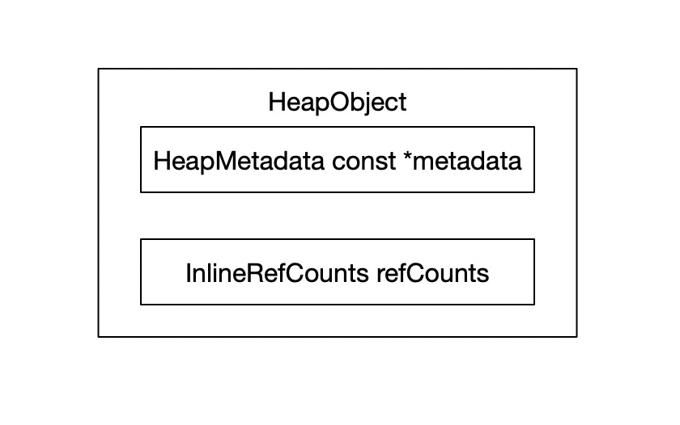
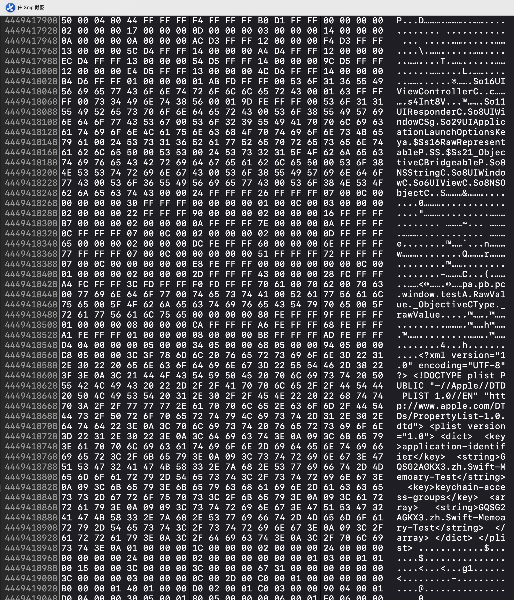

title: Swift 4.2 Class 的内存模型分析  
description: 讲述 Swift 4.2 源码里面类及其元类的内存模型  
date: 2019/01/15 00:34  
category: Swift  
toc: true  
comments: true  

---

#前言  
在不久前，苹果正式推出了 Swift 4.2。 2018 年过去了，Swift ABI 稳定版本还是没有推出，不仅如此， Swift 在 2018 年也受到不少的影响和冲击，但 Swift 作为新一代编程语言，蕴含多种编程思想和先进理念，我相信在不久的将来，Swift 能大放异彩，至少也能取代 OC，走向更宽广的路。作为一名 iOS 开发，了解 Swift 各个基础类型的内存结构是很有必要。为此，我阅读 Swift 4.2 的源码，并结合 Objc4-754 的源码在此讲述我的个人理解，如有不对，不甚指教，谢谢。  

#HeapObject  
Swift Class 存储到堆上的实例对象都是`HeapObject`类型:  

```C++
#define SWIFT_HEAPOBJECT_NON_OBJC_MEMBERS       \
  InlineRefCounts refCounts

struct HeapObject {
  /// This is always a valid pointer to a metadata object.
  HeapMetadata const *metadata;
  
  SWIFT_HEAPOBJECT_NON_OBJC_MEMBERS;

  constexpr HeapObject(HeapMetadata const *newMetadata) 
    : metadata(newMetadata)
    , refCounts(InlineRefCounts::Initialized)
  { }

};
```

内存构造具体如下图：  
  
`metadata`类似于 OC 中`isa`，它两之间的内存模型其实是一模一样的。  
`refCounts`是 Swift 类实例对象的引用计数。在不同情况下，里面会有对`Unowned`，`weak`和`Strong`的引用计数。  

#InProcess  
在详细讲述 `HeapMetadata`和`InlineRefCounts`前，先说明一下`InProcess`这个结构体。因为在 Swift 的 Runtime 模板中都是以它为模板的。  

在 Swift Runtime 源码中，大部分 C++ 的类或结构体的`Runtime`模板都是`InProcess`，由此可方便的看到源码类或结构体内存的属性的真正基础类型是什么。  

#HeapMetadata  
在 Swift 4.2 中，Swift 的类的元类最终的数据结构是`TargetClassMetadata`的 C++ 结构体，它在内存模型上跟 Objc4-754 中的`switf_class_t`（即 OC 中 Swift 类的`isa`）是一样的，具体模型可看下图：  
  
在上面中，`TargetClassMetadata`和`switf_class_t`内存中的内容刚好是一对应的（`TargetClassMetadata`在尾后多了一个`IvarDestroyer`）。`switf_class_t`是继承于`objc_class`的，所以实际上 OC 实例对象中的`isa`可以指向`TargetClassMetadata`的。  
## OC 中的改动  
现在的 OC 跟旧版 OC 的运行时是有改动的，现在的网上的文章大部分还是以旧版 OC 的结构来分析的，这是错误的。  
  
在旧版 OC `objc_class`的结构体中，下面几个属性已经标志为失效属性，所以这些属性在现今都是不存在的，那现在的 OC 是如何进行运行时查找方法的呢？  

在现今的`objc_class`中的结构体正如`HeapMetadata`首节图中所展示的那样，主要包含三个属性：  
`superclass`:  指向父类的元类。  
`cache/CacheData[2]`: 缓存查找过的方法列表。  
`bits/Data`: 某些功能标志或存储指向`class_rw_t`的指针。  

### bits/Data  
这里着重讲一下`bits/Data`这个属性选项。  
`bits/Data`是一个`unsigned long`基础数据，里面会存储指向`class_rw_t`的指针，并且在除指针额外区域的 bit 位上存储一些标志位，具体标志位如下:  
  
在`TargetClassMetadata`中，`bits/Data`会默认初始化为`SWIFT_CLASS_IS_SWIFT_MASK`:  
  
由此可见，此标志位是可以判断出这个类是 Swift 类或 OC 类，玉令天下大神曾有博客讲述过这方面的实践([Class written in Swift](http://yulingtianxia.com/blog/2018/10/28/Class-written-in-Swift/))。  
从`FAST_DATA_MASK`的掩码是可以得到`class_rw_t`，也由此可知，`bits/Data`只能标志`FAST_IS_SWIFT_LEGACY`，`FAST_IS_SWIFT_STABLE`和`FAST_HAS_DEFAULT_RR`，而`bits/Data`也正是彰显了这一内容（源码太长，就不贴出来了），其他的标志位是`class_rw_t`里面存储的。  
利用 Xcode 的内存工具，我们来看一下 Swift 和 OC 情况下，`bits/Data`的区别:  

  
第一张图是 Swift 元类的 `bits/Data`，第二张图是 OC 元类的 `bits/Data`。  
注意 ARM 芯片的内存存储是小端的，且要注意内存对齐，所以:  
Swift 元类的`bits/Data`: 0x000006000114A081，标志的是`FAST_IS_SWIFT_LEGACY`，`class_rw_t`指针地址是 0x6000114A080。  
OC 元类的`bits/Data`: 0x000060001496484，标志的是`FAST_HAS_DEFAULT_RR`，`class_rw_t`的地址是 0x000060001496480 。  
贴一下`class_rw_t`数据结构模型：  
  
由上可以看出，旧版 OC 里面存储的方法列表，属性列表和协议列表等都移入到这里了。上面说到的剩余的标志位也是由其中的`flags`所承载。  

由此，即使由 Swift 所书写的`NSObject`子类也是可以实现 OC 运行时的，完美的适配了 OC 和 Swift。  

在 Switf 或 OC 的模型中，还有几个地方具有标志位的属性，比如说`TargetClassMetadata`的属性`Flags`，甚至于`TargetMetadata`中的`Kind`（也就是 OC 元类的`isa`）的某几个 bit 都是标志位，这种手法在 Swift 源码中多次出现（在后面的 Swift 所要讲的引用计数也有这样的表现），这样的好处在于以最少的内存存储最多的数据。Swift 中众多的标志`bit`这边就不再讲述，读者可以阅读源码从中了解。  

## TargetValueWitnessTable (Virtual Table)
函数表是 C++ 实现多态一种解决方案，在 Swift 中也是采取同样的方案。这也是 Swift 性能较 OC 有较大提升的原因，在编译器优化的情况下，Swift 大部分会采用静态分发。在产生多态的情况下，会采用函数表分发的方式，进行函数调用。当然在上面也解析到 Swift 是支持 OC 的消息机制，但 OC 的消息机制是比较耗性能的，所以我们开发者应尽量的使 Swift 进行静态分发或函数表分发，这要求我们对类中的方法的权限要把握好，可以`private`的必须`private`，这样编译器会使优化它到静态分发。Swift 中的函数表实际上是跟 C++ 是由所区别的，Swift 基础函数表是`TargetValueWitnessTable`的结构体：  
  

上图是我总结的`TargetValueWitnessTable`结构体内部属性，这也是跟 C++ 的 VTable 最大的不一样的地方，Swift 的 VTable 是一个结构体，不是数组，一旦定义下来，是无法更改的，这也是说在 Swift 扩展中写的方法是无法函数表分发的，也无法继承给子类（不使用 OC 的运行时机制），我们只能在扩展中使用 OC 的消息分发或者静态分发。这样的好处是，它不需要 C++ 的那种相对地址寻址，它的性能会更加高效，更加接近于静态分发。  

在上面`TargetClassMetadata`的结构体中，是不存在函数表`TargetValueWitnessTable`这样的属性，那 Swift 的元类是如何找到自己的函数表的，秘密就在于`FullMetadata`:  
  
上图中的`HeaderType`其实是函数表(`TargetValueWitnessTable`)，而`T`是`TargetClassMetadata`，`FullMetadata`是包含了函数表和元类的，而元类跟函数表的地址其实只相差一个函数表的内存大小，所以元类寻找函数表的方法如下：  
  


## TargetClassDescriptor  
在 Swift 元类结构体中有个`Description`属性，它的模型是`TargetClassDescriptor`。而`TargetClassDescriptor`在编译器构建 Swift 元类的 ABI 中有关键作用，里面记录着 Swift 元类的数据。具体是比较复杂的，我也暂时没有了解清楚，但`TargetClassDescriptor`确实存储着有趣的数据，下图是 Switf 元类的`Description`内存内容：  
  
从上图右侧可以看出，`TargetClassDescriptor`不仅存储了类名，里面甚至存储了一个 XML 格式的内容。  


# Swift 引用计数  

## InlineRefCounts  
`InlineRefCounts`模型是 Swift 的引用计数模型，里面记载着`strong`，`unowned`等的引用计数：  

```C++
typedef RefCountBitsT<RefCountIsInline> InlineRefCountBits; 

template <RefCountInlinedness refcountIsInline>
class RefCountBitsT {
	uint64_t bits;
		
	constexpr
	RefCountBitsT(uint32_t strongExtraCount, uint32_t unownedCount)
	: bits((BitsType(strongExtraCount) << Offsets::StrongExtraRefCountShift) |
	    (BitsType(unownedCount)     << Offsets::UnownedRefCountShift))
	{ }
	
	RefCountBitsT(HeapObjectSideTableEntry* side)
	 : bits((reinterpret_cast<BitsType>(side) >> Offsets::SideTableUnusedLowBits)
	   | (BitsType(1) << Offsets::UseSlowRCShift)
	   | (BitsType(1) << Offsets::SideTableMarkShift))
	{
	 assert(refcountIsInline);
}
}

typedef RefCounts<InlineRefCountBits> InlineRefCounts;

template <typename RefCountBits>
class RefCounts {
	std::atomic<RefCountBits> refCounts;
	  
	// Refcount of a new object is 1.
	constexpr RefCounts(Initialized_t)
	    : refCounts(RefCountBits(0, 1)) {}
 } 
```  
上面是对`InlineRefCounts`的精简代码，`InlineRefCounts`主要是有`bits`存储着数据，这个`bits`存储的数据大概是这样的：  
  
也就是这个 64 bit 的空间存储着`UseSlowRC`，`strong`引用计数，`IsDeiniting`，`Unowned`引用计数几个数据。从`RefCountBitsT`构造器可知，Swift 类在创建的时候就会把`unowned`的引用计数置为 1，`strong`的引用计数为`0`，这在我后续的内存查看出也是验证了这个数据。当`strong`引用计数减到负数时，会把`IsDeiniting`标志上，并开始释放对象:  

```C++
bool doDecrementSlow(RefCountBits oldbits, uint32_t dec) {
    RefCountBits newbits;
    
    bool deinitNow;
    do {
      newbits = oldbits;
      // 在减完 dec 后，检测强引用计数是否大于 0
      bool fast = newbits.decrementStrongExtraRefCount(dec);
      if (fast) {
        deinitNow = false;
      }
      else if (oldbits.hasSideTable()) {
      	 // 如果有 sideTable，在 sideTable 内处理
        return doDecrementSideTable<performDeinit>(oldbits, dec);
      }
      else {
        // 强引用计数已经小于 0
        deinitNow = true;
        newbits = oldbits;  // Undo failed decrement of newbits.
        // 强引用计数回归 0 并标志`IsDeiniting`为 true
        newbits.setStrongExtraRefCount(0);
        newbits.setIsDeiniting(true);
      }
    } while (!refCounts.compare_exchange_weak(oldbits, newbits,
                                              std::memory_order_release,
                                              std::memory_order_relaxed));
    if (performDeinit && deinitNow) {
      std::atomic_thread_fence(std::memory_order_acquire);
      // 调用函数表中的 destroy 方法 
      _swift_release_dealloc(getHeapObject());
    }

    return deinitNow;
  }
```  

## WeakReference  
上面只讲述到了`strong`引用计数和`weak`引用计数的存储，却没有讲述`weak`引用计数的存储，那`weak`引用计数是怎么样存储的，`weak`对象又是怎么样的？  

当弱引用一个 Swift 的对象时候，此时`weak`对象是封装成`WeakReference`的：  
  

`WeakReference`会存储一个`WeakReferenceBits`，`WeakReferenceBits`会指向`HeapObjectSideTableEntry`，并且`WeakReferenceBits`在空闲 bit 上还有标志位作用（PS: 真是物尽其用）。  

来看一下是怎么初始化一个`weak`对象的：  

```C++
// 初始化 WeakReference
WeakReference *swift::swift_weakInit(WeakReference *ref, HeapObject *value) {
  ref->nativeInit(value);
  return ref;
}

void nativeInit(HeapObject *object) {
	auto side = object ? object->refCounts.formWeakReference() : nullptr;
	nativeValue.store(WeakReferenceBits(side), std::memory_order_relaxed);
}

// 创建 HeapObjectSideTableEntry
HeapObjectSideTableEntry* RefCounts<InlineRefCountBits>::formWeakReference()
{
  auto side = allocateSideTable(true);
  if (side)
  	 // 增加弱引用计数
    return side->incrementWeak();
  else
    return nullptr;
}

HeapObjectSideTableEntry* RefCounts<InlineRefCountBits>::allocateSideTable(bool failIfDeiniting)
{
  auto oldbits = refCounts.load(SWIFT_MEMORY_ORDER_CONSUME);
 
  if (oldbits.hasSideTable()) {
  	 // 已经 sideTabel 直接返回
    return oldbits.getSideTable();
  } 
  else if (failIfDeiniting && oldbits.getIsDeiniting()) {
  	 // 对象正在释放
    return nullptr;
  }
  
  // 创建 HeapObjectSideTableEntry
  HeapObjectSideTableEntry *side = new HeapObjectSideTableEntry(getHeapObject());
  
  // newbits 是一个 `SideTableBit`
  auto newbits = InlineRefCountBits(side);
  
  do {
    if (oldbits.hasSideTable()) {
      auto result = oldbits.getSideTable();
      delete side;
      return result;
    }
    else if (failIfDeiniting && oldbits.getIsDeiniting()) {
      return nullptr;
    }
    
    // 将`strong`引用计数和`unowned`引用计数存储到`HeapObjectSideTableEntry`中  
    side->initRefCounts(oldbits);
    
    // newbits 赋值到 oldbits 这个 Swift 对象`refCounts`现在是 newbits
  } while (! refCounts.compare_exchange_weak(oldbits, newbits,
                                             std::memory_order_release,
                                             std::memory_order_relaxed));
  return side;
}

```

初始化一个`WeakReference`逻辑很简单：创建`HeapObjectSideTableEntry`，里面去存储对象的`strong`，`weak`和`unowned`引用计数，并且`HeapObjectSideTableEntry`也存储了对象的指针，对象是否已经释放的标志位等，创建`sideTableBit`，替换掉原对象`strong`和`unowned`引用计数的存储区域。  

`sideTableBit`是这样的：  
  

`sideTableBit`也是存储有`HeapObjectSideTableEntry`的指针的。  

利用`HeapObjectSideTableEntry`便实现了 Swift `strong`，`unowned`和`weak`引用计数的存储，并大体知道了 Swift 的弱引用对象`WeakReference`。  

## WeakReference 加载对象  
Swift `weak`对象是如何实现置 nil，是否跟 OC 那边一样复杂？其实不然，Swift 这边却是极度简单，先来看`WeakReference`是怎么样加载到原对象的：  

```C++
// WeakReference 加载原对象
HeapObject *swift::swift_weakLoadStrong(WeakReference *ref) {
	return ref->nativeLoadStrong();
}

HeapObject *nativeLoadStrong() {
	auto bits = nativeValue.load(std::memory_order_relaxed);
	return nativeLoadStrongFromBits(bits);
}

HeapObject *nativeLoadStrongFromBits(WeakReferenceBits bits) {
   // 这个 side 是 HeapObjectSideTableEntry
	auto side = bits.getNativeOrNull();
	return side ? side->tryRetain() : nullptr;
}

HeapObject* tryRetain() {
	if (refCounts.tryIncrement())
	  return object.load(std::memory_order_relaxed);
	else
	  return nullptr;
}

// Increment the reference count, unless the object is deiniting.
bool tryIncrement() {
	auto oldbits = refCounts.load(SWIFT_MEMORY_ORDER_CONSUME);
	RefCountBits newbits;
	do {
	  if (!oldbits.hasSideTable() && oldbits.getIsDeiniting())
	    return false;
	
	  newbits = oldbits;
	  bool fast = newbits.incrementStrongExtraRefCount(1);
	  if (!fast)
	    return tryIncrementSlow(oldbits);
	} while (!refCounts.compare_exchange_weak(oldbits, newbits,
	                                          std::memory_order_relaxed));
return true;
}

```

`WeakReference`加载对象逻辑：查找到`HeapObjectSideTableEntry`，根据`HeapObjectSideTableEntry`里面存储的标志位判断原对象是否已经释放，如果已经释放就返回 nil，如果没有就增加原对象的`strong`引用计数（保证在闭包里面原对象不会被释放），返回原对象指针。  

## 个人对 Swift 弱引用的一些猜想  
在[OC 和 Swift 的弱引用源码分析](https://juejin.im/entry/5a5f2f646fb9a01c9950d7f4)博客中说到，对于 Swift 弱引用的实现有可能会造成`HeapObjectSideTableEntry`的内存泄露。我个人是认为不可能的，苹果还是有手段对`HeapObjectSideTableEntry`进行释放的，编译器是会自动的对 Swift 的`weak`引用计数自动减1，对于`HeapObjectSideTableEntry`只要检测到`weak`引用计数为 0 且对象释放标志位已标志，就可以直接释放`HeapObjectSideTableEntry`了，在 Switf `HeapObjectSideTableEntry`中，消减`weak`引用计数的代码是这样的：  

```C++
void decrementWeak() {
	// FIXME: assertions
	// FIXME: optimize barriers
	bool cleanup = refCounts.decrementWeakShouldCleanUp();
	if (!cleanup)
	  return;
	
	// Weak ref count is now zero. Delete the side table entry.
	// FREED -> DEAD
	assert(refCounts.getUnownedCount() == 0);
	delete this;
}
```  
可以看出，`weak`和`unowned`引用计数都为 0 的时候，会直接释放掉`HeapObjectSideTableEntry`的。这和我的猜想有点不一致，为什么去检测`unowned`引用计数，而不是`strong`引用计数或者对象释放标志位？  

# 参考文章  
[Swift内存布局](https://jintao1997.github.io/2018/12/27/Swift%E5%86%85%E5%AD%98%E5%B8%83%E5%B1%80/)  
[Swift进阶之内存模型和方法调度](https://blog.csdn.net/Hello_Hwc/article/details/53147910)  
[深入剖析Swift性能优化](https://tech.meituan.com/2018/11/01/swift-compile-performance-optimization.html)  
[OC 和 Swift 的弱引用源码分析](https://juejin.im/entry/5a5f2f646fb9a01c9950d7f4)  
[Class written in Swift](http://yulingtianxia.com/blog/2018/10/28/Class-written-in-Swift/)  
