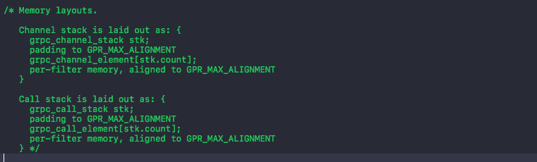
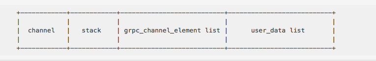
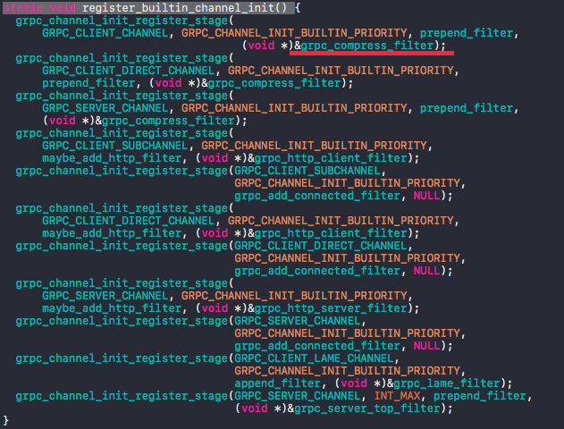

title: gRPC 通道层解析  
description: 详细讲述 gRPC 通道层是怎么运作的  
date: 2017/2/7 14:34  
category: iOS-gRPC  
toc: true  
comments: true  

---

# grpc\_completion\_queue 如何获取网络事件  
在应用层中，创建一个`grpc_completion_queue`后，便设计一条新线程，开启死循环，调用  
`grpc_completion_queue_next`函数，监听网络事件。  
`grpc_completion_queue_next`函数(删除不必要的代码)：  

```C
grpc_event grpc_event grpc_completion_queue_next(grpc_completion_queue *cc,
                                      gpr_timespec deadline, void *reserved) {
  grpc_event ret;
  grpc_pollset_worker *worker = NULL;
  int first_loop = 1;
  gpr_timespec now;
  grpc_exec_ctx exec_ctx = GRPC_EXEC_CTX_INIT;
  deadline = gpr_convert_clock_type(deadline, GPR_CLOCK_MONOTONIC);
  GRPC_CQ_INTERNAL_REF(cc, "next");
  gpr_mu_lock(cc->mu);
  for (;;) {
    if (cc->completed_tail != &cc->completed_head) {
      grpc_cq_completion *c = (grpc_cq_completion *)cc->completed_head.next;
      cc->completed_head.next = c->next & ~(uintptr_t)1;
      if (c == cc->completed_tail) {
        cc->completed_tail = &cc->completed_head;
      }
      gpr_mu_unlock(cc->mu);
      ret.type = GRPC_OP_COMPLETE;
      ret.success = c->next & 1u;
      ret.tag = c->tag;
      c->done(&exec_ctx, c->done_arg, c);
      break;
    }
    if (cc->shutdown) {
      gpr_mu_unlock(cc->mu);
      memset(&ret, 0, sizeof(ret));
      ret.type = GRPC_QUEUE_SHUTDOWN;
      break;
    }
    now = gpr_now(GPR_CLOCK_MONOTONIC);
    if (!first_loop && gpr_time_cmp(now, deadline) >= 0) {
      gpr_mu_unlock(cc->mu);
      memset(&ret, 0, sizeof(ret));
      ret.type = GRPC_QUEUE_TIMEOUT;
      break;
    }
    first_loop = 0;
    gpr_timespec iteration_deadline = deadline;
    if (grpc_timer_check(&exec_ctx, now, &iteration_deadline)) {
      GPR_TIMER_MARK("alarm_triggered", 0);
      gpr_mu_unlock(cc->mu);
      grpc_exec_ctx_flush(&exec_ctx);
      gpr_mu_lock(cc->mu);
      continue;
    } else {
      grpc_error *err = grpc_pollset_work(&exec_ctx, POLLSET_FROM_CQ(cc),
                                          &worker, now, iteration_deadline);
      if (err != GRPC_ERROR_NONE) {
        gpr_mu_unlock(cc->mu);
        const char *msg = grpc_error_string(err);
        gpr_log(GPR_ERROR, "Completion queue next failed: %s", msg);
        grpc_error_free_string(msg);
        GRPC_ERROR_UNREF(err);
        memset(&ret, 0, sizeof(ret));
        ret.type = GRPC_QUEUE_TIMEOUT;
        break;
      }
    }
  }
  grpc_exec_ctx_finish(&exec_ctx);

  return ret;
}
```
逻辑描述：  
检测`cc`是否有事件，有就调用`c->done(&exec_ctx, c->done_arg, c)`后返回事件。  
`cc`内没有事件，检测`cc`是否关闭和超时(超时不可能，外部设置是无限时间)，如果超时或者关闭，返回。  
`cc`内没有事件，超时和关闭，则调用`grpc_pollset_work`函数(`poll`函数)，挂起这个线程，直到`cc`有改变，避免死循环浪费性能。  
>`c->done(&exec_ctx, c->done_arg, c)`调用的是`call.c`文件内  
>`finish_batch_completion`函数。  

**NOTE：poll 函数用于监测多个等待事件，若事件未发生，进程睡眠，放弃 CPU 控制权，若监测的任何一个事件发生，poll 将唤醒睡眠的进程，并判断是什么等待事件发生，执行相应的操作。poll 函数退出后，struct pollfd 变量的所有值被清零，需要重新设置。**  

外部是如何激活这个线程呢？调用  

```C
void grpc_cq_end_op(grpc_exec_ctx *exec_ctx, grpc_completion_queue *cc,
                    void *tag, grpc_error *error,
                    void (*done)(grpc_exec_ctx *exec_ctx, void *done_arg,
                                 grpc_cq_completion *storage),
                    void *done_arg, grpc_cq_completion *storage)
```
便可以激活线程。  


# grpc\_call 注册网络事件的过程  
在应用层中，调用
  
```Objectivec
- (void)startBatchWithOperations:(NSArray *)operations errorHandler:(void (^)())errorHandler
```
发起网络事件注册，下一步调用`call.c`中的  

```C
grpc_call_error grpc_call_start_batch(grpc_call *call, const grpc_op *ops,
                                      size_t nops, void *tag, void *reserved) {
  grpc_exec_ctx exec_ctx = GRPC_EXEC_CTX_INIT;
  grpc_call_error err;
  
  if (reserved != NULL) {
    err = GRPC_CALL_ERROR;
  } else {
    err = call_start_batch(&exec_ctx, call, ops, nops, tag, 0);
  }

  grpc_exec_ctx_finish(&exec_ctx);
  return err;
}
```
进一步调用`call_start_batch`，限于这个函数篇幅太长，这里不再贴出，只讲述其中逻辑：  
创建一个`grpc_transport_stream_op`对象`stream_op`，初始化`stream_op`，然后调用  

```C
static void execute_op(grpc_exec_ctx *exec_ctx, grpc_call *call,
                       grpc_transport_stream_op *op) {
  grpc_call_element *elem;
  
  elem = CALL_ELEM_FROM_CALL(call, 0);
  op->context = call->context;
  elem->filter->start_transport_stream_op(exec_ctx, elem, op);
}
```
这个函数就是利用`grpc_call_element`发起网络事件注册，具体就要看`call`现在拥有的`grpc_call_element`了。  

# 通道层关键类    
通道层关键的类有：  

* grpc\_channel  
* grpc\_channel\_stack  
* grpc\_channel\_element  
* grpc\_channel\_filter  
* grpc\_call\_stack  
* grpc\_call\_element 

`grpc_channel_filter`表示通道层网络请求的所要执行的动作，`grpc_channel_element`会存储一个`grpc_channel_filter`，`grpc_channel_stack`是前两者在内存的寻址基底，可以通过`grpc_channel_stack`找到前两者。  

`grpc_call_stack`和`grpc_call_element`可以对应`grpc_channel`的`grpc_channel_element`和`grpc_channel_filter`。在创建`grpc_call`的时候会从相对应的`grpc_channel`获取这些数据。  

创建`grpc_call`，而不直接使用`grpc_channel`(两者很多内容是一致的，比如 filter 和 element)原因在于，`grpc_call`包含有`grpc_completion_queue`，可以将网络事件推送到`grpc_completion_queue`(通过`grpc_cq_end_op`函数)。    

Channel Stack  和 Call Stack 存储形式如下：  
  

可以简易理解成：  
  
上图截图于[GRPC Channel](http://www.sailsxu.com/?p=602#12)。  


## Channel Filter 结构

```C
/* Channel filters specify:
. the amount of memory needed in the channel & call (via the sizeof_XXX
      members) channel & call 的内存使用量
. functions to initialize and destroy channel & call data
      (init_XXX, destroy_XXX) 定义接口比如创建和销毁 channel & call data
. functions to implement call operations and channel operations (call_op,
      channel_op) 定义 channel 和 call 操作的接口
. a name, which is useful when debugging

   Members are laid out in approximate frequency of use order. */
typedef struct {
  /* 很熟悉，就是要看的 start_transport_stream_op */
  void (*start_transport_stream_op)(grpc_exec_ctx *exec_ctx,
                                    grpc_call_element *elem,
                                    grpc_transport_stream_op *op);
  /* Channel 级别的操作，比如 new calls, transport 和 closure */
  /* 可以看  grpc_channel_next_op */
  void (*start_transport_op)(grpc_exec_ctx *exec_ctx,
                             grpc_channel_element *elem, grpc_transport_op *op);

  size_t sizeof_call_data;
  /*
     初始化 call data
     elem 在 call 开始的时候被创建
     server_transport_data 是一个不透明的指针，如果是 NULL 则
     这个 call 来自客户端，否则来自服务端，大多数的 filter 不需要
     关心这个参数
  */
  void (*init_call_elem)(grpc_exec_ctx *exec_ctx, grpc_call_element *elem,
                         grpc_call_element_args *args);
  void (*set_pollset)(grpc_exec_ctx *exec_ctx, grpc_call_element *elem,
                      grpc_pollset *pollset);
  /* 销毁 call data */
  void (*destroy_call_elem)(grpc_exec_ctx *exec_ctx, grpc_call_element *elem);

  size_t sizeof_channel_data;
  /*
     初始化 channel elemment
     is_first, is_last 标志了该 element 在 stack 中的位置
  */
  void (*init_channel_elem)(grpc_exec_ctx *exec_ctx, grpc_channel_element *elem,
                            grpc_channel_element_args *args);
  /* 销毁 channel element */
  void (*destroy_channel_elem)(grpc_exec_ctx *exec_ctx,
                               grpc_channel_element *elem);

  /* 实现 grpc_call_get_peer() */
  char *(*get_peer)(grpc_exec_ctx *exec_ctx, grpc_call_element *elem);

  /* 该 filter 的名字，用于调试 */
  const char *name;
} grpc_channel_filter;
```
上面注释来源于[gRPC Python 源码浅析 - Channel](http://ju.outofmemory.cn/entry/247132)。  

这里不再详细说明如何创建`grpc_call`和`grpc_channel`，可以参考上面的两篇文章，基本逻辑是使用`Channel Filter`来动作网络连接。  

在 iOS 下的通道层用的`Channel Filter`是`grpc_compress_filter`，这个`grpc_compress_filter`是在`init.c`的函数`static void register_builtin_channel_init()`中设置的：  
  
上面红线就是设置的`Channel Filter`。  

可以看一下`grpc_compress_filter`的构成：  

```C
const grpc_channel_filter grpc_compress_filter = {
    compress_start_transport_stream_op,
    grpc_channel_next_op,
    sizeof(call_data),
    init_call_elem,
    grpc_call_stack_ignore_set_pollset_or_pollset_set,
    destroy_call_elem,
    sizeof(channel_data),
    init_channel_elem,
    destroy_channel_elem,
    grpc_call_next_get_peer,
    "compress"};
```
关键点在于`compress_start_transport_stream_op`，注册事件都是经过这个函数的。  
在 *grpc\_call 注册网络事件的过程* 段落中，`call`现在拥有的`grpc_call_element`就是`grpc_compress_filter`，而`elem->filter->start_transport_stream_op(exec_ctx, elem, op);`执行的就是`compress_start_transport_stream_op`。  