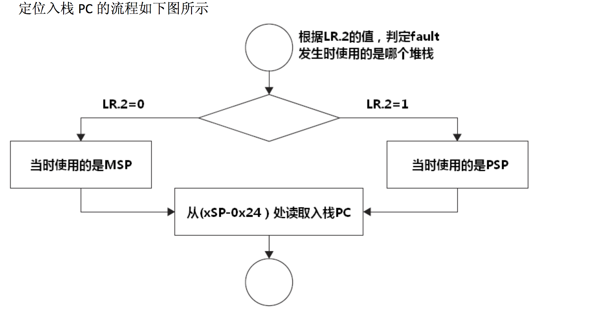

title: ZHOS 中的任务切换  
description: 简单介绍 ZHOS 的任务切换在 STM32 中是如何实现的  
date: 2017/5/3 10:48  
category: 毕业设计  
comments: true  
toc: true  

---

# ZHOS 任务切换的环境  
ZHOS 是在 STM32F103ZE 系列实现的，如果需要切换到其他芯片系列，那任务切换的汇编代码必然是要更新的，这里只描述在 STM32F103ZE 芯片中是如何实现的，其他芯片的实现主要要参考该芯片的文档。开发环境是 MDK，如果是其他开发环境，它的代码也或许要稍加修改。    

STM32F103ZE 是意法半导体 32 位 MCU 中的 Cortex-M3 内核中的高档产品，拥有 72 M 的主频，所以 ZHOS 中的任务切换汇编代码都适用于 Coretex-M3 内核的 MCU。  

# 实现任务切换  
实现任务的切换关键点在于要实现函数调用过程中的保护现场和恢复现场。  
在编译器编译代码的时候，函数之间的编译是分别编译的。编译出来的汇编代码，各个函数都可能使用到相同的寄存器，这样如果函数调用中，不进行对这些数据的保存，那主函数的这些数据肯定会丢失，如此便会造成代码无法执行下去。对这些数据的保存叫做保护叫做现场保护。当程序结束后，返回到调用的主程序中，需要恢复主程序的数据，这就叫做恢复现场。上面所说的数据不仅包括函数执行过程中产生的寄存器数据，还包括那些函数中的临时变量。这些数据统一的保存在一个称为 _栈_ 的数据结构中。栈是 FILO 的一种数据结构，这样就可以实现了按执行顺序可以恢复现场和保护现场。  

在 ARM 的汇编体系中，栈的结构是高地址向低地址生长的。这是取决于 ARM 的汇编指令 `LDM` 和 `SDM` 的压栈方向。这些情况在等下的代码中有所体现，值得我们注意。  

## Cortex-M3 中任务切换  
在 Cortex-M3 中，如果你在 ISR 中执行任务切换，想切入线程模式中，这会造成硬件触发用法 fault 错误，所以我们在中断服务程序中，是万万不能触发任务切换，不然会造成系统崩溃。这样就带来一个问题，中断中如何切换任务？这就跟 ZHOS 怎么样触发任务切换有关了，在 ZHOS 当发起任务切换请求的时候，会触发 PendSv 异常，在 PendSv 进行任务的切换，而 PendSv 的中断优先级是最低的，只能在其他中断结束后才能执行，这样做虽然任务切换有点延迟，但是应该最合理。这种中断引起的延迟也是任何系统都无法避免的。  

在 ZHOS 中，是以协程理念写调度器的，并没有在 SysTick 中切换任务，所以不必担忧 SysTick 跟任务切换共振现象。  

Cortex-M3 支持两种模式，两种模式是 thread 模式和 handler 模式：  

1. thread 模式是执行普通应用程序的，可以分为特权级和用户级，特权级可以访问所有的寄存器，而用户级只能访问特定的寄存器，如果访问了，会产生 fault。  
2. handler 模式是异常触发的时候所用的模式，而且 handler 模式只有特权级。  

在 thread 模式的特权级中可以修改 CONTROL[0] 进入用户级，而用户级是无法访问 CONTROL[0] 的，只用触发异常进入 handler 模式才能重新修改 CONTROL[0] 进入线程模式的特权级。复位以后处于线程模式加特权级。  

在 ZHOS 中，只使用了 thread 模式特权级和 handler 模式，没有使用 thread 模式用户级。 ZHOS 只是一个轻量级的操作系统内核，不必弄的太复杂，使效率降低。  

在 Cortex-M3 中，有两种堆栈指针：  

1. 主堆栈指针（MSP）：复位后缺省使用的堆栈指针，用于操作系统内核以及异常处理例程（包括中断服务例程）。  
2. 进程堆栈指针（PSP）：由用户的应用程序代码使用。堆栈指针的最低两位永远是0，这意味着堆栈总是4 字节对齐的。  

ZHOS 所创建的任务都在 PSP 中，这里必须得注意 PSP 栈指针必须是 4 字节对齐的，刚好ZHOS 内存分配是 32 字节对齐且每一内存块都是 32 字节，所以 PSP 栈指针肯定是 4 字节对齐的。  

MSP 和 PSP 在硬件中是处于同一个寄存器内的，都是 R13 寄存器，所以两种寄存器是不能共存的，要么处于 MSP 中，要么处于 PSP 中。  

ZHOS 任务请求的大体过程是这样的：

1. 任务 A 请求任务切换，将 PendSV 异常悬起；  
2. 是否有其他异常，如果有其他异常，调用其他异常的服务函数，然后执行 PendSV 服务函数，如果没有其他异常，则直接执行 PendSV 异常服务函数；  
3. 在 PendSV 异常服务函数中，在开始和结束的地方会将硬件的中断关闭和开启，避免其他异常影响任务切换；  
4. 切换完任务后，回到线程模式，执行其他任务代码。  

从上面可以看得出，相对比其他 OS，ZHOS 并没有触发 SVCall 去发起任务切换，这是因为 ZHOS 本是简单的内核系统，不必要弄那么复杂，并不存在很多的系统服务，就省略 SVC。  

# ZHOS 任务切换具体代码解析  
ZHOS 中，任务切换代码具体在 `switch.c` 文件中，整个 ZHOS 核心代码就是 `TaskSwitch` 和 `PendSV_Handler` 两个函数：

```c
__ASM void TaskSwitch(void)
{
    LDR     R0, =0xE000ED22
    LDR     R1, =0xFF
    STRB    R1, [R0]
    LDR     R0, =0xE000ED04               
    LDR     R1, =0x10000000
    STR     R1, [R0]
    BX      LR
	  ALIGN
}


__ASM void PendSV_Handler(void)
{
		IMPORT  TaskRuning
		IMPORT  TaskNew
	
    CPSID   I                                                   
    MRS     R0, PSP                                             
    CBZ     R0, NoSave                           

    SUBS    R0, R0, #0x20                                       
    STM     R0, {R4-R11}

    LDR     R1, =TaskRuning                                     
    LDR     R1, [R1]
    STR     R0, [R1]                                            
                                                              
NoSave

    LDR     R0, =TaskRuning                                     
    LDR     R1, =TaskNew
    LDR     R2, [R1]
    STR     R2, [R0]

    LDR     R0, [R2]                                            
    LDM     R0, {R4-R11}                                        
    ADDS    R0, R0, #0x20
    MSR     PSP, R0                                             
    ORR     LR, LR, #0x04                                       
    CPSIE   I
    BX      LR                                                 
    ALIGN
}
```  

`TaskSwitch` 主要功能是设置 PendSV 的优先级为 0xFF（最低优先级），且触发 PendSV 异常。  

`PendSV_Handler` 是 PendSV 的异常服务函数，在里面主要实现任务的切换，也就是保护现场和恢复现场。  

`CPSID I` 和 `CPSIE I` 分别是 关中断和开中断，这样，在 PendSV 中就不会被其他异常打断任务切换，也可以说明，整个 PendSV 服务函数的操作都是原子性的。  

PendSV 异常服务函数大体可以这样说明：

```c
__ASM void PendSV_Handler(void)
{
		引进 TaskRuning
		引进  TaskNew
	
     关中断
     将 PSP 赋值到 R0                                                   
  	 如果 R0 等于 0，跳转到 NoSave，否则继续执行                                                                     
	
	 R0 内的值减少 0x20
 	 以 R0 为栈基地址，将 R4 到 R11 寄存器的值压入栈中                                       

	 将 TaskRuning 的地址赋值到 R1
     将 R1 内容指向的内存内容赋值到 R1                                    
   	 将 R0 的内容赋值到 R1 所存的地址指向的内存                                            
                                                              
NoSave

	将 TaskRuning 的地址赋值到 R0
    将 TaskNew 的地址赋值到 R1                                 
    将 R1 内容所指向的内存内容赋值到 R2
    将 R2 内容赋值到 R0 内容指向的内存
	
	将 R2 内容指向的内存内容赋值给 R0
    以 R0 为栈基地址，出栈 R4 到 R11 寄存器                                            
    R0 的内容自增 0x20                                        
    将 R0 的值赋值到 PSR 寄存器                                             
    ORR     LR, LR, #0x04                                       
    开启中断
    BX      LR                                                 
    ALIGN
}
```  

上面大体说明了现场保护和恢复现场是怎么实现，在 NoSave 前面讲述的是保护线程，而 NoSave 后面的是任务切换和恢复现场。  

在 PendSV 异常服务函数中，并没有对 R0，R1等寄存器的压栈和出栈，这是在 Cortex-M3 中会在进入异常函数前将 xPSR，PC，LR，R12，R3，R2，R1，R0 寄存器压栈，结束异常服务函数后也会将它们出栈，所以这些不需要我们处理，这在 <Cortex-M3权威指南> 有所说明。注意，在进入异常服务函数后，LR 寄存器不再代表的是函数后结束后的执行地址。在异常服务函数内的 LR 寄存器更多的是表明在异常函数结束后用 PSP 还是 MSP，这取决于 LR.2 的值，所以在上面会有 `ORR     LR, LR, #0x04` ，确保异常函数结束后，执行的是 PSP，具体可看下图：  

  

调用 `BX LR` 也只是为了表明 PendSV 异常服务函数的结束。  

# 编写任务切换代码的注意点
编写任务切换代码需要自己特别了解所使用的代码的内核，了解它的寄存器结构和汇编指令，需要知道明白哪里可以切换任务，哪里不能切换任务，但不管是什么芯片，大体都遵循以下的流程：  

1. 任务 A呼叫 SVC来请求任务切换（例如，等待某些工作完成）

2. OS接收到请求，做好上下文切换的准备，并且悬起一个 PendSV异常。

3. 当 CPU退出 SVC后，它立即进入 PendSV，从而执行上下文切换。

4. 当 PendSV执行完毕后，将返回到任务 B，同时进入线程模式。

5. 发生了一个中断，并且中断服务程序开始执行

6. 在 ISR执行过程中，发生 SysTick异常，并且抢占了该 ISR。

7. OS执行必要的操作，然后悬起 PendSV异常以作好上下文切换的准备。

8. 当 SysTick退出后，回到先前被抢占的 ISR中，ISR继续执行

9. ISR执行完毕并退出后，PendSV服务例程开始执行，并且在里面执行上下文切换

10. 当 PendSV执行完毕后，回到任务 A，同时系统再次进入线程模式
