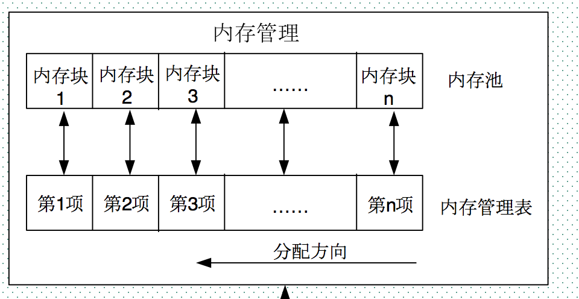

title: ZHOS 中的内存管理  
description: 简单介绍 ZHOS 中内存管理函数 mymalloc 等  
date: 2017/5/2 15:00  
category: 毕业设计  
comments: true  
toc: true  

---

# ZHOS 不使用默认内存管理原因  
在 c 的标准库中，有默认的 `malloc`，`free` 等函数，在这里，我们并没有使用这些函数，因此在 stm32 的启动文件，我将堆的大小设置为 0 :

```c
Stack_Size      EQU     0x00000400

                AREA    STACK, NOINIT, READWRITE, ALIGN=3
Stack_Mem       SPACE   Stack_Size
__initial_sp
                                                  
; <h> Heap Configuration
;   <o>  Heap Size (in Bytes) <0x0-0xFFFFFFFF:8>
; </h>
; no use cm3 heap  my os can create heap
Heap_Size       EQU     0x00000000

                AREA    HEAP, NOINIT, READWRITE, ALIGN=3
__heap_base
Heap_Mem        SPACE   Heap_Size
__heap_limit
```  

如上可以看见，栈的大小是 0x400，而堆的大小已经设置为 0x00。在实际应用中，栈的设置可以设置小一点，因为在 ZHOS 中，都没有怎么使用这个栈，每个任务都有自己的栈，这个会在其他篇节加以说明。  

在 ZHOS 中不使用默认内存管理主要是为了精细化管理，优化性能，可以为下一版本提供更多的可能性。如果使用默认的内存管理，我们将无法对内存进行管理，这对以后的扩展会产生很大的阻碍。其次如果单片机外部扩展了 SRAM，我们使用自己写的内存管理函数，可以很容易的补充上去。  

# ZHOS 内存管理实现的基本原理  
ZHOS 内存管理的实现代码基本在 `memoary.h` 和 `memoary.c` 文件中。  

在 ZHOS 中的内存管理是分块式内存管理：  
分块式内存管理由内存池和内存管理表两部分组成。内存池被等分为n块，对应的内存管理表，大小也为n，内存管理表的每一个项对应内存池的一块内存。  
内存管理表的项值代表的意义：当该项值为0的时候，代表对应的内存块未被占用，当该项值非零的时候，代表该项对应的内存块已经被占用，其数值则代表被连续占用的内存块数。比如某项值为10，那么说明包括本项对应的内存块在内，总共分配了10个内存块给外部的某个指针。  
内寸分配方向：是从顶底的分配方向。即首先从最末端开始找空内存。当内存管理刚初始化的时候，内存管理表全部清零，表示没有任何内存块被占用。  

  

ZHOS 中有统一的内存管理器：

```c
// 32 字节对齐 保证首字节地址对齐
__attribute__((aligned(32))) static u8 membase[MEM_MAX_SIZE]; //内存池
static u16 memmapbase[MEM_ALLOC_TABLE_SIZE]; // 内存表

struct _m_mallco_dev
{
    u8 	*membase;
    u16 *memmap;
    u8  memrdy;
};

static struct _m_mallco_dev _mallco_dev=
{
	membase,
	memmapbase,
	0,
};
```  

从上可以看见，在内存管理器中，有一个内存池和内存表，这也就是上面所说的内存池和内存管理表，这里值得注意的是，在分配内存池的时候，强制编译器 32 字节对齐 `__attribute__((aligned(32)))`。这主要是为了方便 MCU 的读取效率，保证内存池的首地址肯定能被 32 整除，这样才能字节对齐，才有更高的读取效率，如果不这样做，在 ARM 的 CPU 是影响效率，在其他类型的 CPU 可能会出现崩溃。  

## 分配原理
内存分配的核心函数是 `_mem_malloc`：  

```c
static u32 _mem_malloc(u32 size)
{  
    signed long offset=0;  
    u32 nmemb;
	u32 cmemb=0;
    u32 i;  
    if(!_mallco_dev.memrdy) _mem_init();
    if(size==0)return 0XFFFFFFFF;
    nmemb=size/MEM_BLOCK_SIZE;
    if(size%MEM_BLOCK_SIZE)nmemb++;
    for(offset=MEM_ALLOC_TABLE_SIZE-1;offset>=0;offset--)
    {     
		if(!_mallco_dev.memmap[offset])cmemb++;
		else cmemb=0;
		if(cmemb==nmemb)
		{
            for(i=0;i<nmemb;i++)
            {  
                _mallco_dev.memmap[offset+i]=nmemb;
            }  
            return (offset*MEM_BLOCK_SIZE);
		}
    }  
    return 0XFFFFFFFF;
}
```  

当调用 `_mem_malloc` 申请内存的时候，先判断要分配的内存块数（m），然后从第n项开始，向下查找，直到找到m块连续的空内存块（即对应内存管理表项为0），然后将这m个内存管理表项的值都设置为m（标记被占用），最后，把最后的这个空内存块的相对于内存池基地址的相对地址返回去，完成一次分配。注意，如果当内存不够的时候（找到最后也没找到连续的m块空闲内存），则返回 0XFFFFFFFF，表示分配失败。  

## 释放原理  
内存释放的核心函数是 `_mem_free`：  

```c
static u8 _mem_free(u32 offset)
{  
    int i;  
    if(!_mallco_dev.memrdy)
	{
		_mem_init();
        return 1;
    }  
    if(offset<MEM_MAX_SIZE)
    {  
        int index=offset/MEM_BLOCK_SIZE;
        int nmemb=_mallco_dev.memmap[index];
        for(i=0;i<nmemb;i++)
        {  
            _mallco_dev.memmap[index+i]=0;
        }  
        return 0;  
    }else return 2;
}
```  

`_mem_free` 函数先判断相对地址的内存地址所对应的内存块，然后找到对应的内存管理表项目，得到所占用的内存块数目m（内存管理表项目的值就是所分配内存块的数目），将这m个内存管理表项目的值都清零，标记释放，完成一次内存释放。  

# ZHOS 内存管理的改进点  
在 ZHOS 中的内存管理中，并没有对内存进行优化，会产生很多内存碎片，对内存管理效率造成了重大影响，在下一步改进中，可以对内存管理的碎片进行重分配，尽量产生少的碎片，优化管理效率。  

# 参考文献
[【正点原子探索者STM32F407开发板例程连载+教学】第42章 内存管理实验](http://www.openedv.com/thread-43375-1-1.html)