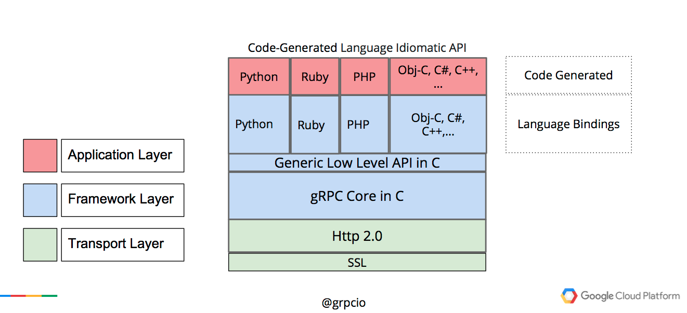
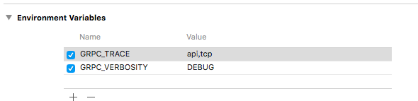

title: gRPC 在 MAC 的安装和基本架构简述  
description: gRPC 如何在 MAC OS 系统中安装和基本架构讲述  
date: 2017/2/4 14:31  
category:  iOS-gRPC  
comments: true  
toc: true  

---
# 相关工具的安装  
1. OS X 版本必须等于或者高于10.11。  
2. Cocoapods 版本高于 1.0 以上，可以使用`pod --version`去检查 Cocoapods 的版本，如果没有安装 Cocoapods，网上有大批教程学习。  
3. Xcode 版本必须等于大于7.2。必须确保安装命令行工具，可以使用  
	`sudo xcode-select --install`安装命令行工具。
4. 必须安装 Homebrew，可以使用`brew --version`去检查有没有安装 Homebrew；如果没有安装，可以执行  

	```
	ruby -e "$(curl -fsSL https://raw.githubusercontent.com/Homebrew/install/master/install)"  
	```
	去安装 Homebrew。
5. 使用 Homebrew 安装 autoconf, automake, libtool, pkg-config，使用  
	`brew install autoconf automake libtool pkg-config`去安装。
6. 下载 Demo，`git clone https://github.com/grpc/grpc.git`。
7. 安装 gPRC 的插件和库：  

	```
	cd grpc  
	git submodule update --init  
	make  
	sudo make install  
	```
	上面进行 `make` 操作的时候，会出现问题，解决方法[make question](https://github.com/google/protobuf/issues/2182)。  

8. 安装`protoc`编译器：  

	```
	brew tap grpc/grpc
	brew install google-protobuf
	```
9. 运行服务器：

	```
	cd examples/cpp/helloworld
	make
	./greeter_server &
	```
10. 运行客户端：

	```
	cd ../../objective-c/helloworld
	pod install
	```
	

**相关文章阅读:**   
[gRPC 官方文档中文版 V1.0](http://doc.oschina.net/grpc?t=60140)  
[Protocol Buffer技术详解(语言规范)](http://www.cnblogs.com/stephen-liu74/archive/2013/01/02/2841485.html)  
[Objective-C Quickstart](http://www.grpc.io/docs/quickstart/objective-c.html)

# gRPC 基本架构
  
如上图所示，gRPC 的代码结构主要分为三层：  
1. 运输层，最低层，基于 Http2.0 和 SSL。  
2. 通道层（Channel层），核心的 C 代码，实现与运输层的交互。  
3. 应用层，各种语言的实现，实现各种语言调用通道层的 C 代码。  

PS: gRPC 的 Java 和 Go 语言版本不由上面架构实现，Java 和 Go 有自己的高性能网络库。  

# gRPC 的环境变量  
调试 gRPC 要设置 gRPC 的环境变量，这样可以看出 gRPC 的相关输出，相关文档在[gRPC environment variables](https://github.com/grpc/grpc/blob/master/doc/environment_variables.md)。  
这里建议设置的环境变量为：
  